# Predictive-Maintenance
# Code Report: Predictive Maintenance with Machine Learning

## Introduction
The provided code aims to address the problem of predictive maintenance using machine learning techniques. Predictive maintenance is crucial for industries to avoid unexpected machine failures, reduce downtime, and optimize maintenance schedules. By leveraging historical data and machine learning algorithms, it's possible to predict when maintenance is required before a breakdown occurs. The code performs data preprocessing, model creation, model evaluation, and prediction for custom input.

## Motivation and Problem Statement
Predictive maintenance is essential for industries to minimize downtime, optimize maintenance schedules, and reduce costs associated with unexpected machine failures. The objective is to predict the type of failure a machine might experience based on its operational data.

## Code Execution

### Data Preprocessing
- The code first reads in two datasets: To show that the model works even if on two separate datasets.
- Data preprocessing steps include:
    - Handling missing values
    - Encoding categorical variables
    - Scaling numerical features
    - Removing outliers

### Model Creation
- Various classification models are trained on the datasets to predict different failure types. These models include:
    - Logistic Regression
    - Random Forest
    - AdaBoost
    - Bagging
    - SVM (Support Vector Machine)
- For each model, the code evaluates its performance using accuracy scores.

### Detecting the Best Model
- The code selects the best-performing model for each dataset based on mean accuracy scores.

### Prediction for Custom Input
- After selecting the best model for Dataset 1, the code retrains the selected model using the entire Dataset 1.
- It then predicts failure types for a custom user input provided as a dictionary.

## Results
The results include data visualizations, model evaluation metrics, and insights into model performance.

### Data Visualization
- Scatter plots and heat maps are generated for each failure type in both datasets. These visualizations help understand the relationships between features and failure types.

### Model Evaluation
- Accuracy scores are calculated for each model and each failure type.
- A bar graph compares the mean accuracy of different models, providing insights into their performance.

### Graphs and Accuracy Values
- All scatter plots, heat maps, and accuracy graphs are included in this section for easy reference.

#### Scatter Plots
- Scatter plots are generated for each failure type in both datasets to visualize the relationships between features and failure types.
##### Scatter Plots for Dataset 1
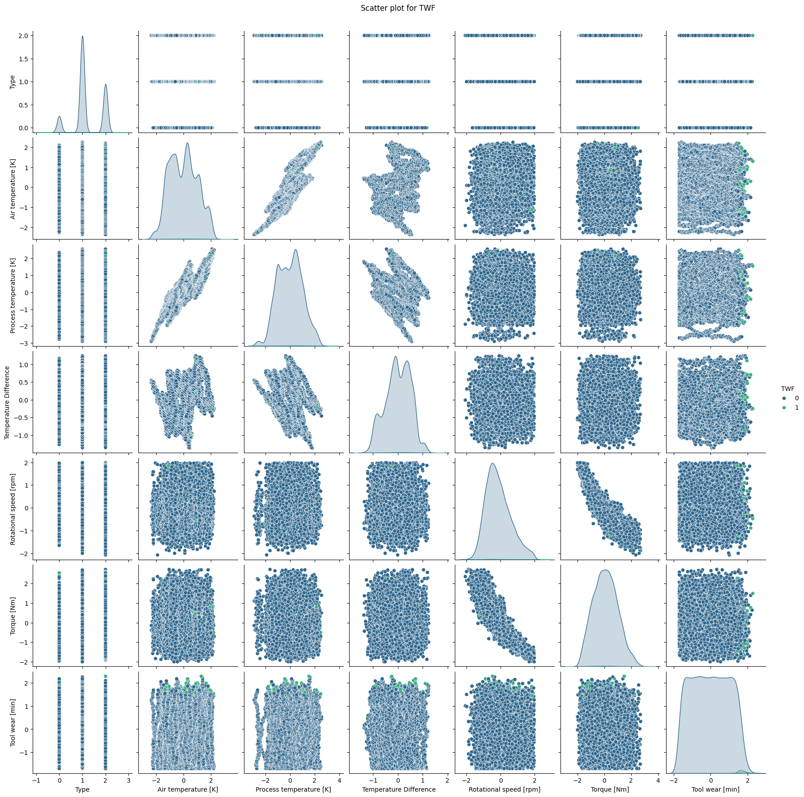

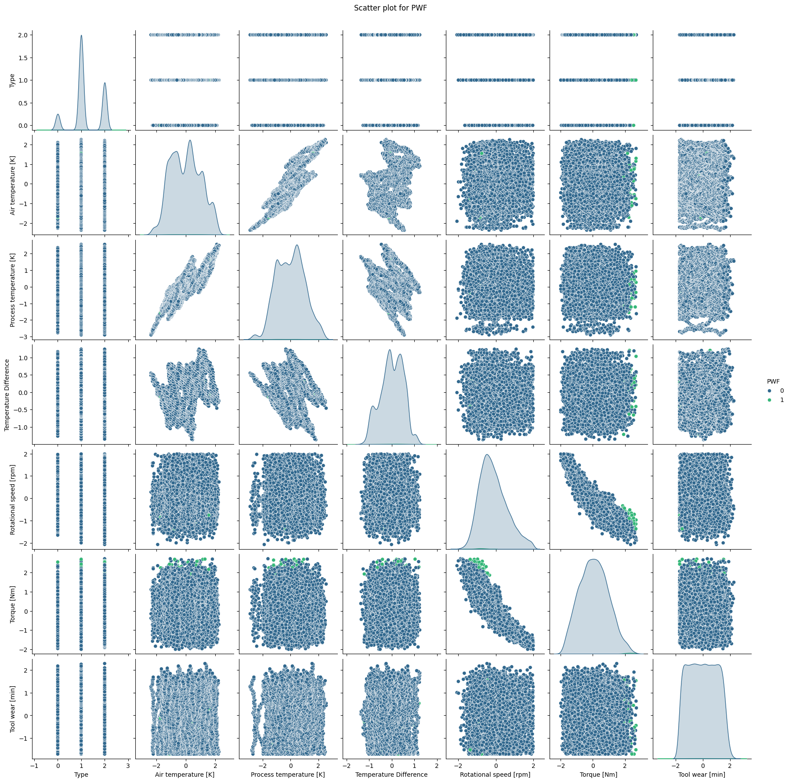

##### Scatter Plots for Dataset 2
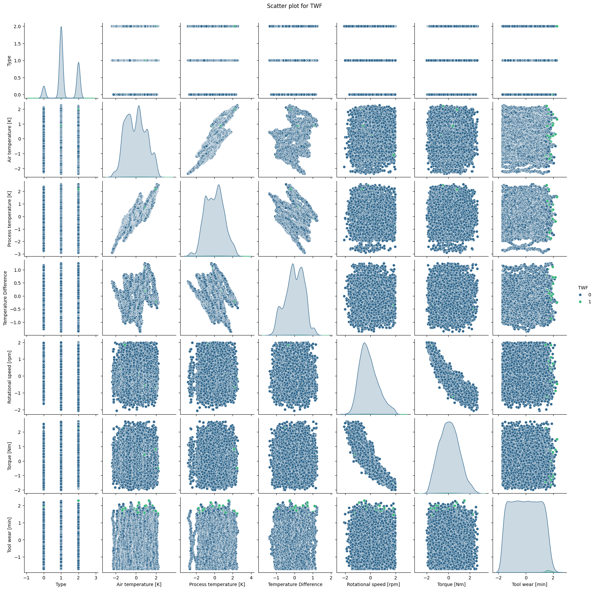
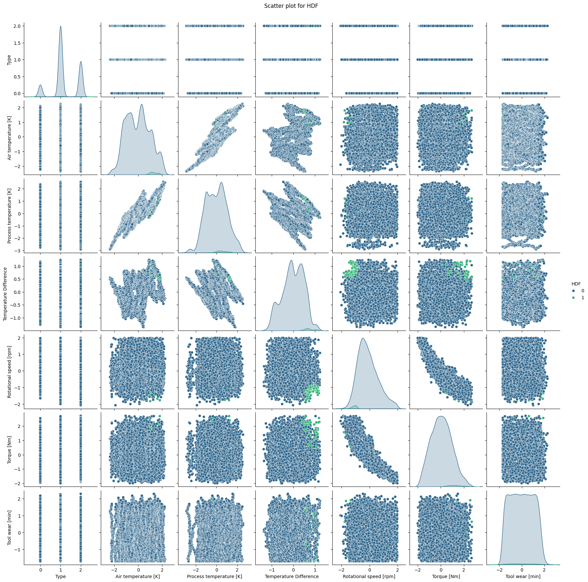

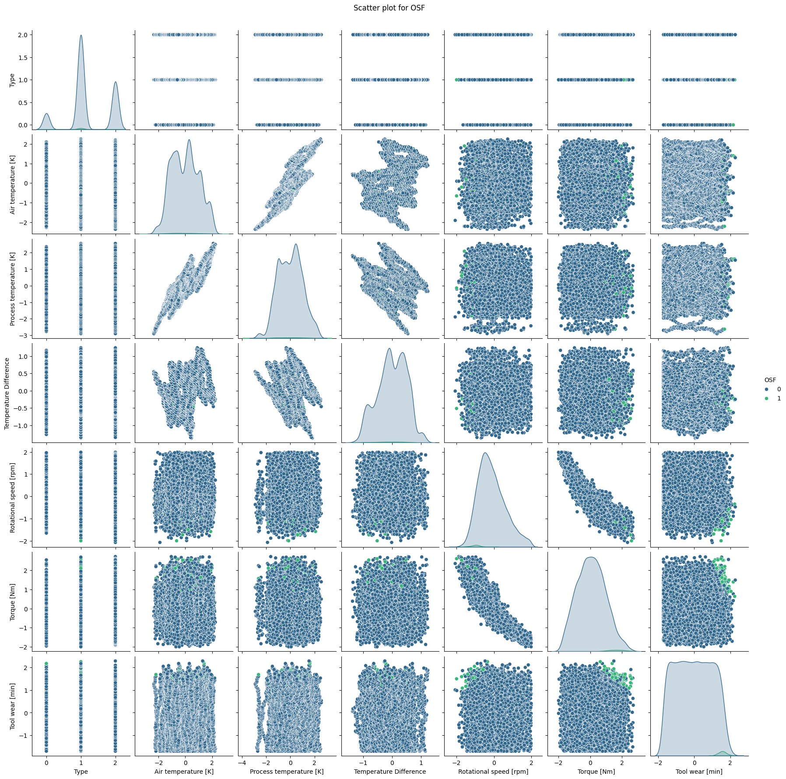
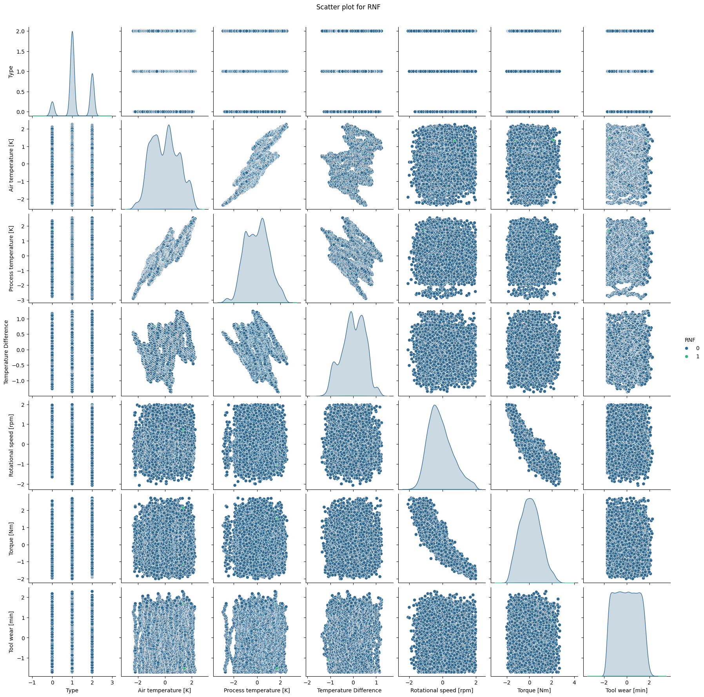

#### Heat Maps
- Heat maps are generated for each failure type in both datasets to visualize the correlations between features and failure types.
##### Heat Maps for Dataset 1

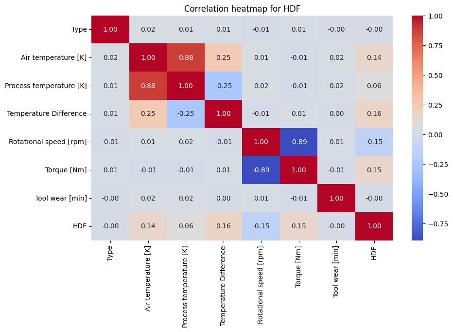

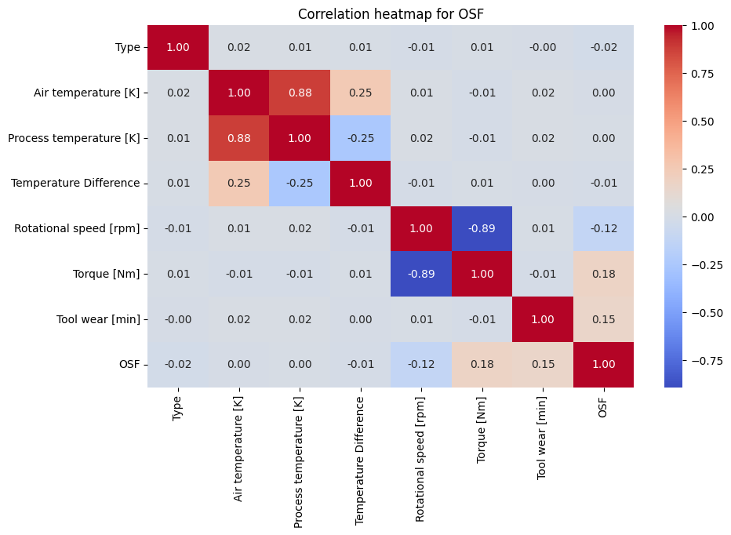

##### Heat Maps for Dataset 2
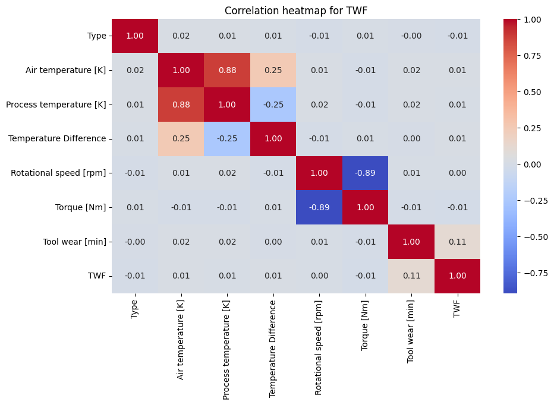

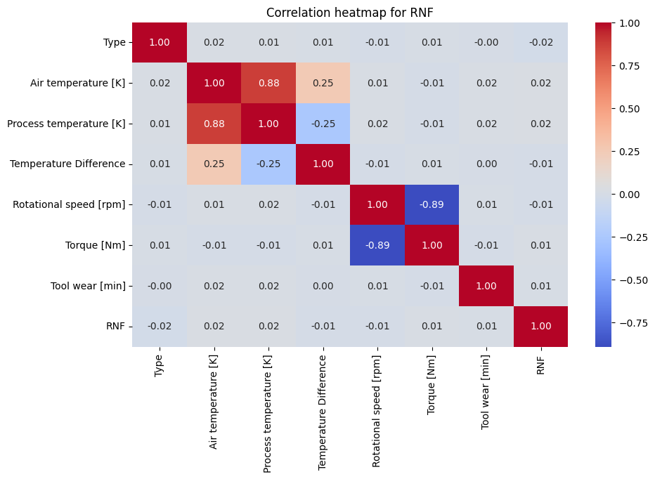

#### Accuracy Graph
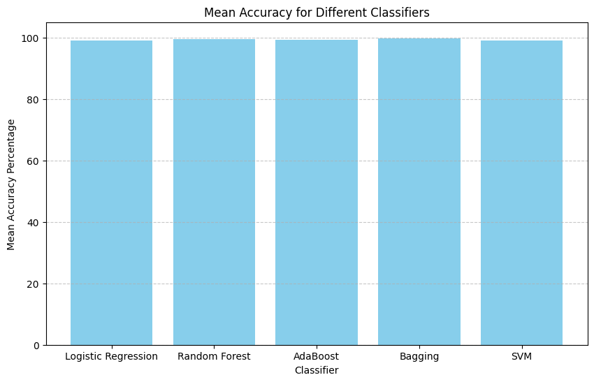

#### Accuracy Values
- Logistic Regression:
    - Dataset 1:
      - Machine failure Accuracy: 0.9706652697747512
      - TWF Accuracy: 0.9968569931901519
      - HDF Accuracy: 0.9910948140387638
      - PWF Accuracy: 0.9968569931901519
      - OSF Accuracy: 0.9931901519119958
      - RNF Accuracy: 0.997904662126768
      - Mean Accuracy for Logistic Regression: 99.10948140387637
    - Dataset 2:
      - Machine failure Accuracy: 0.9696176008381352
      - TWF Accuracy: 0.9968569931901519
      - HDF Accuracy: 0.9910948140387638
      - PWF Accuracy: 0.9968569931901519
      - OSF Accuracy: 0.9910948140387638
      - RNF Accuracy: 0.997904662126768
      - Mean Accuracy for Logistic Regression: 99.05709795704557
- Random Forest:
    - Dataset 1:
      - Machine failure Accuracy: 0.9879518072289156
      - TWF Accuracy: 0.9968569931901519
      - HDF Accuracy: 0.9984284965950759
      - PWF Accuracy: 0.9973808276584599
      - OSF Accuracy: 0.9937139863803038
      - RNF Accuracy: 0.997904662126768
      - Mean Accuracy for Random Forest: 99.53727955299458
    - Dataset 2:
      - Machine failure Accuracy: 0.9858564693556836
      - TWF Accuracy: 0.9968569931901519
      - HDF Accuracy: 0.9994761655316919
      - PWF Accuracy: 0.9973808276584599
      - OSF Accuracy: 0.9937139863803038
      - RNF Accuracy: 0.997904662126768
      - Mean Accuracy for Random Forest: 99.51981840405098
- AdaBoost:
    - Dataset 1:
      - Machine failure Accuracy: 0.9717129387113672
      - TWF Accuracy: 0.9968569931901519
      - HDF Accuracy: 0.9994761655316919
      - PWF Accuracy: 0.9984284965950759
      - OSF Accuracy: 0.9968569931901519
      - RNF Accuracy: 0.997904662126768
      - Mean Accuracy for AdaBoost: 99.35393748908679
    - Dataset 2:
      - Machine failure Accuracy: 0.9722367731796753
      - TWF Accuracy: 0.9968569931901519
      - HDF Accuracy: 1.0
      - PWF Accuracy: 0.9984284965950759
      - OSF Accuracy: 0.9937139863803038
      - RNF Accuracy: 0.997904662126768
      - Mean Accuracy for AdaBoost: 99.31901519119958
- Bagging:
    - Dataset 1:
      - Machine failure Accuracy: 0.9884756416972237
      - TWF Accuracy: 0.9968569931901519
      - HDF Accuracy: 1.0
      - PWF Accuracy: 0.998952331063384
      - OSF Accuracy: 0.9952854897852279
      - RNF Accuracy: 0.997904662126768
      - Mean Accuracy for Bagging: 99.6245852977126
    - Dataset 2:
      - Machine failure Accuracy: 0.9879518072289156
      - TWF Accuracy: 0.9968569931901519
      - HDF Accuracy: 1.0
      - PWF Accuracy: 0.998952331063384
      - OSF Accuracy: 0.9942378208486118
      - RNF Accuracy: 0.997904662126768
      - Mean Accuracy for Bagging: 99.59839357429719
- SVM:
    - Dataset 1:
      - Machine failure Accuracy: 0.9685699319015191
      - TWF Accuracy: 0.9968569931901519
      - HDF Accuracy: 0.9905709795704557
      - PWF Accuracy: 0.997904662126768
      - OSF Accuracy: 0.9931901519119958
      - RNF Accuracy: 0.997904662126768
      - Mean Accuracy for SVM: 99.08328968046096
    - Dataset 2:
      - Machine failure Accuracy: 0.9675222629649031
      - TWF Accuracy: 0.9968569931901519
      - HDF Accuracy: 0.9910948140387638
      - PWF Accuracy: 0.997904662126768
      - OSF Accuracy: 0.9905709795704557
      - RNF Accuracy: 0.997904662126768
      - Mean Accuracy for SVM: 99.03090623363018

## Reasoning for Bagging's Superior Performance
Bagging, or Bootstrap Aggregating, combines multiple models (typically decision trees) trained on different subsets of the training data, thereby reducing variance and improving stability. Here's why Bagging might result in the best performance:

- **Reduction of Overfitting:** By training multiple models on different subsets of data, Bagging reduces overfitting and variance, leading to more robust predictions.
- **Increased Generalization:** Combining predictions from multiple models reduces the risk of bias and can lead to better generalization on unseen data.
- **Better Handling of Complex Relationships:** Bagging can capture complex relationships between features and target variables by aggregating predictions from multiple models, each trained on different aspects of the data.
- **Robustness to Noisy Data:** Bagging is less sensitive to noisy data compared to individual models, as it averages out predictions across multiple models.

Overall, Bagging's ability to reduce overfitting, improve generalization, and handle complex relationships makes it a powerful ensemble learning technique for predictive maintenance tasks.

## Conclusion
In conclusion, the code successfully addresses the problem of predictive maintenance by leveraging machine learning techniques. By preprocessing the data, creating models, and evaluating their performance, it provides insights into machine failure prediction. The inclusion of visualizations and accuracy metrics enhances the understanding of model behavior and performance.

